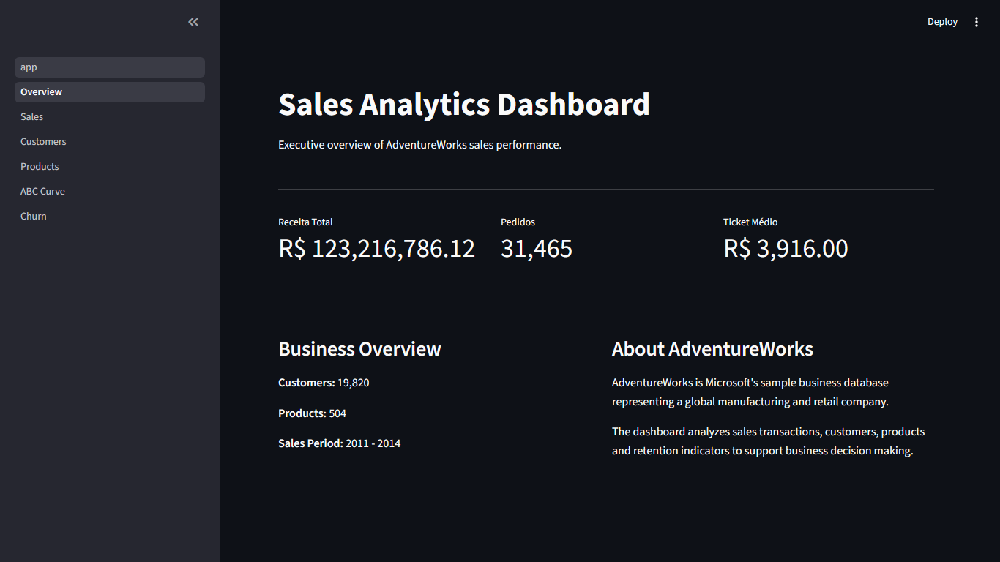
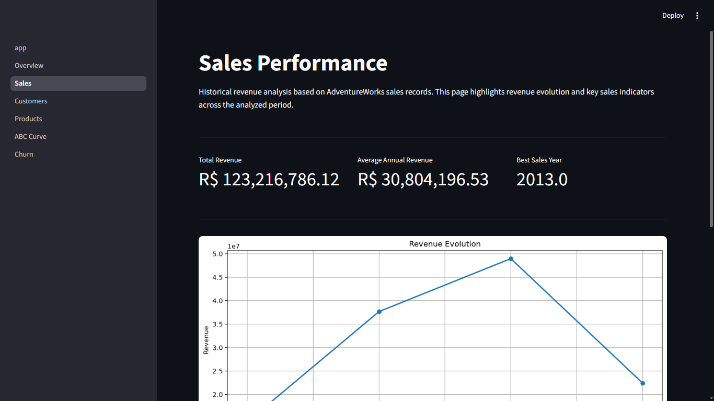
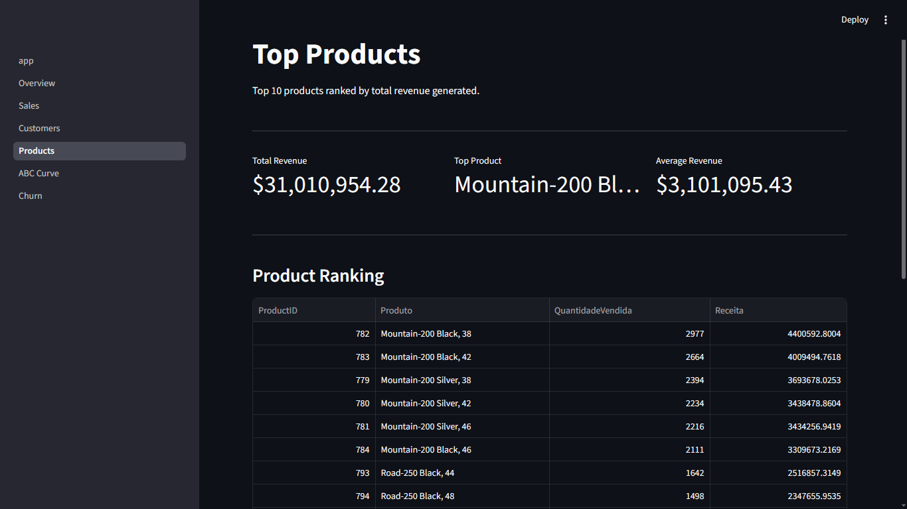
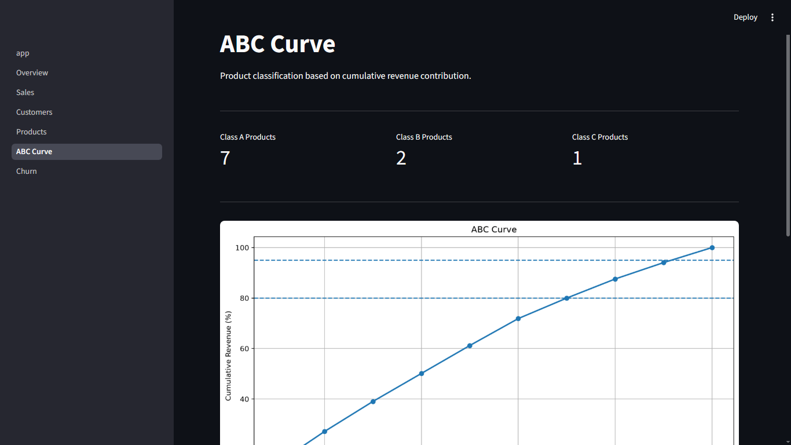
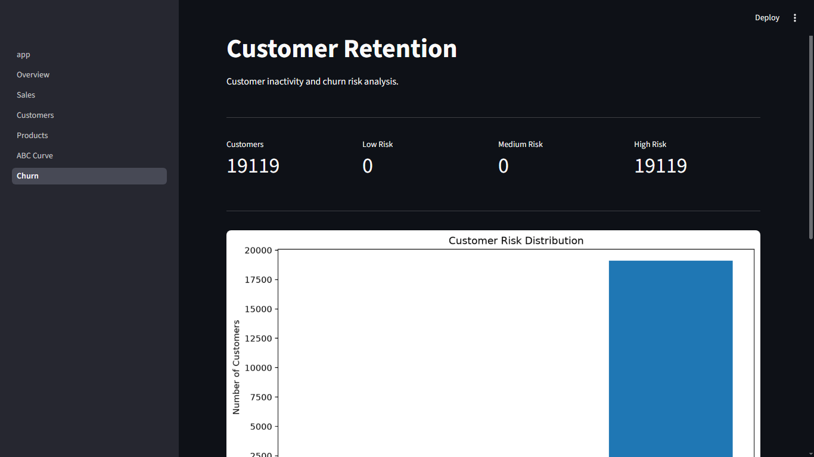

# Sales Analytics Platform

Business Intelligence and Sales Analytics Dashboard built with Python, SQL Server, Pandas, Matplotlib, and Streamlit using the AdventureWorks2022 database.

The project demonstrates an end-to-end analytics workflow, from SQL-based data extraction to dashboard development, focusing on business metrics, customer behavior, product performance, and retention analysis.

---

## Project Overview

This project was developed to simulate a real-world sales analytics environment.

Using Microsoft's AdventureWorks database, the dashboard provides insights into:

- Revenue performance
- Customer analysis
- Product performance
- ABC classification
- Customer retention and churn risk

The objective is to transform transactional data into actionable business information through interactive visualizations and executive KPIs.

---

## Business Problem

Organizations generate large volumes of transactional data every day, but raw data alone does not support decision-making.

Business leaders need answers to questions such as:

- How much revenue is the company generating?
- Who are the most valuable customers?
- Which products drive the highest revenue?
- How concentrated are sales across products?
- Which customers are at risk of churn?

This dashboard addresses those questions through analytical SQL queries and interactive reporting.

---

## Dataset

### AdventureWorks2022

AdventureWorks is Microsoft's sample transactional database representing a fictional manufacturing and retail company.

Main domains used:

- Sales
- Customers
- Products
- Orders

Database engine:

- Microsoft SQL Server

---

## Technology Stack

### Programming

- Python 3

### Database

- SQL Server

### Data Processing

- Pandas

### Visualization

- Matplotlib

### Dashboard

- Streamlit

### Database Connectivity

- SQLAlchemy
- PyODBC

---

## Project Structure

```text
sales-analytics-platform/

├── dashboard/
│   ├── assets/
│   ├── components/
│   └── pages/
│
├── sql/
│   └── business/
│
├── notebooks/
│
├── docs/
│
├── database/
│
├── config.py
├── database.py
├── query_executor.py
├── sql_loader.py
├── requirements.txt
└── README.md
```

---

## Dashboard Pages

### 1. Overview

Executive summary of business performance.

Features:

- Total Revenue
- Total Orders
- Average Ticket
- Customer Count
- Product Count
- Business Context

---

### 2. Sales Performance

Historical revenue analysis.

Features:

- Revenue trend visualization
- Best sales year
- Average annual revenue
- Revenue history table

---

### 3. Customer Analysis

Top customers ranked by revenue.

Features:

- Customer revenue ranking
- Order volume analysis
- Revenue contribution
- Customer performance table

---

### 4. Product Analysis

Top-selling products by revenue.

Features:

- Product ranking
- Revenue analysis
- Quantity sold
- Product performance table

---

### 5. ABC Analysis

ABC Curve classification based on revenue contribution.

Categories:

- A Products
- B Products
- C Products

Business value:

- Inventory prioritization
- Product portfolio analysis
- Revenue concentration analysis

---

### 6. Customer Retention

Customer inactivity and churn risk analysis.

Risk levels:

- Low Risk
- Medium Risk
- High Risk

Features:

- Churn risk classification
- Customer inactivity analysis
- Retention metrics
- Customer detail table

---

## Key SQL Analyses

The dashboard is powered by analytical SQL queries:

- 01_revenue.sql
- 02_orders.sql
- 03_average_ticket.sql
- 04_sales_over_time.sql
- 05_top_customers.sql
- 06_top_products.sql
- 07_customer_recency.sql
- 08_business_summary.sql

These queries transform transactional data into business metrics consumed by the dashboard.

---

## Screenshots

Add screenshots after publishing:

## Overview



## Sales Performance



## Customer Analysis


## Product Analysis



## ABC Analysis



## Customer Retention



---

## Installation

Clone the repository:

```bash
git clone https://github.com/YOUR_USERNAME/sales-analytics-platform.git
```

Enter the project directory:

```bash
cd sales-analytics-platform
```

Create a virtual environment:

```bash
python -m venv .venv
```

Activate the environment:

### Windows

```bash
.venv\Scripts\activate
```

### Linux / macOS

```bash
source .venv/bin/activate
```

Install dependencies:

```bash
pip install -r requirements.txt
```

---

## Database Configuration

Edit:

```text
config.py
```

Example:

```python
SERVER = r"YOUR_SERVER"
DATABASE = "AdventureWorks2022"
DRIVER = "ODBC Driver 17 for SQL Server"
TRUSTED_CONNECTION = "yes"
```

---

## Running the Dashboard

From the project root:

```bash
streamlit run dashboard/app.py
```

The application will open in your browser.

---

## Skills Demonstrated

### SQL

- Aggregations
- Joins
- Ranking
- Business metrics
- Customer analysis
- Product analysis

### Python

- Data processing
- Modular project organization
- Error handling
- Data visualization

### Business Intelligence

- KPI design
- Customer analytics
- Revenue analysis
- Churn analysis
- ABC classification

### Data Visualization

- Executive dashboards
- Interactive reporting
- Analytical charts

---

## Future Improvements

Possible next steps:

- Forecasting models
- Customer segmentation
- RFM analysis
- Cohort analysis
- Automated reporting
- Cloud deployment

---

## Author

**Rodrigo C. Furlan**

Data Analytics | Business Intelligence | Python | SQL | Data Visualization

LinkedIn:
https://www.linkedin.com/in/rodrigo-cezar-furlan-635888174/

---

## License

This project is available for educational and portfolio purposes.
